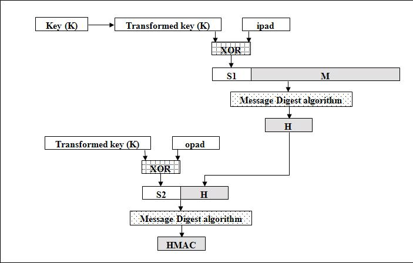

## HMAC算法

[原文](http://blog.csdn.net/fw0124/article/details/8473858)

### Message Authentication Code (MAC)消息鉴别码

- Similar to message digest/与消息摘要相似
- In addition, also involves encryption/ 另外，涉及加密
- Sender and receiver must know a shared secret key/ 发送方和接收方必须知道共享密钥
- 可确认消息未被修改
- 可确认消息是由发送端发送
- 传统上构造MAC基于分组密码,但近年来研究构造MAC的兴趣已转移到杂凑函数
 - 密码杂凑函数(如MD5、SHA)的软件实现快于分组密码(如DES)的软件实现；
 - 密码杂凑函数的库代码来源广泛；
 - 密码杂凑函数没有出口限制，而分组密码即使用于MAC也有出口限制

### Hash-based Message Authentication Code (HMAC)

- involving a cryptographic hash function in combination with a secret cryptographic key. 结合了散列函数和密钥。
- As with any MAC, it may be used to simultaneously verify both the data integrity and the authenticity of a message. 可确认消息未被修改，可确认消息是由发送端发送
- Any cryptographic hash function, such as MD5 or SHA-1, may be used in the calculation of an HMAC;任何散列函数都可以用于计算HMAC


### HMAC的定义

**hmac算法公式 ： HMAC(K,M)=H(K⊕opad∣H(K⊕ipad∣M))**
H 代表所采用的HASH算法(如SHA-256)
K 代表认证密码
Ko 代表HASH算法的密文
M 代表一个消息输入
B 代表H中所处理的块大小,这个大小是处理块大小,而不是输出hash的大小
如,SHA-1和SHA-256 B = 64
SHA-384和SHA-512 B = 128
L 表示hash的大小
Opad 用0x5c重复B次
Ipad 用0x36重复B次
Apad 用0x878FE1F3重复(L/4)次

定义HMAC需要一个加密用散列函数（表示为H）和一个密钥K。
我们假设H是一个将数据块用一个基本的迭代压缩函数来加密的散列函数。
我们用B来表示数据块的字长。（以上说提到的散列函数的分割数据块字长B=64），
用L来表示散列函数的输出数据字长（MD5中L=16(128位),SHA—1中L=20(160位)）。
鉴别密钥的长度可以是小于等于数据块字长的任何正整数值。
应用程序中使用的密钥长度若是比B大，则首先用使用散列函数H作用于它，然后用H输出的L长度字符串作为在HMAC中实际使用的密钥。
一般情况下，推荐的最小密钥K长度是L个字长。（与H的输出数据长度相等）。

我们将定义两个固定且不同的字符串ipad,opad：
（‘i','o'标志内部与外部）
ipad = the byte 0x36 repeated B times
opad = the byte 0x5C repeated B times.
计算‘text'的HMAC：
H( K XOR opad, H(K XOR ipad, text))
即为以下步骤:

(1) 在密钥K后面添加0来创建一个子长为B的字符串。
(例如，如果K的字长是20字节，B＝64字节，则K后会加入44个零字节0x00)
(2) 将上一步生成的B字长的字符串与ipad做异或运算。
(3) 将数据流text填充至第二步的结果字符串中。
(4) 用H作用于第三步生成的数据流。
(5) 将第一步生成的B字长字符串与opad做异或运算。
(6) 再将第四步的结果填充进第五步的结果中。
(7) 用H作用于第六步生成的数据流，输出最终结果



伪代码:
```
function hmac (key, message)
    if (length(key) > blocksize) then
        key = hash(key) // keys longer than blocksize are shortened
    end if
    if (length(key) < blocksize) then
        key = key ∥ [0x00 * (blocksize - length(key))] // keys shorter than blocksize are zero-padded ('∥' is concatenation)
    end if

    o_key_pad = [0x5c * blocksize] XOR key // Where blocksize is that of the underlying hash function
    i_key_pad = [0x36 * blocksize] XOR key

    return hash(o_key_pad ∥ hash(i_key_pad ∥ message)) // Where '∥' is concatenation
end function
```
#### 密钥
用于HMAC的密钥可以是任意长度（比B长的密钥将首先被H处理）。
但当密钥长度小于L时的情况时非常令人失望的，因为这样将降低函数的安全强度。
长度大于L的密钥是可以接受的，但是额外的长度并不能显著的提高函数的安全强度。
密钥必须随机选取(或使用强大的基于随机种子的伪随机生成方法)，并且要周期性的更新。
（目前的攻击没有指出一个有效的更换密钥的频率，因为那些攻击实际上并不可行。然而，周期性更新密钥是一个对付函数和密钥所存在的潜在缺陷的基本的安全措施，并可以降低泄漏密钥带来的危害。）

### HMAC加密算法的安全性

HMAC加密算法引入了密钥，其安全性已经不完全依赖于所使用的HASH算法，安全性主要有以下几点保证：

1. 使用的密钥是双方事先约定的，第三方不可能知道。由上面介绍应用流程可以看出，作为非法截获信息的第三方，能够得到的信息只有作为“挑战”的随机数和作为“响应”的HMAC结果，无法根据这两个数据推算出密钥。由于不知道密钥，所以无法仿造出一致的响应。
1. 在HMAC加密算法的应用中，第三方不可能事先知道输出（如果知道，不用构造输入，直接将输出送给服务器即可）。
1. HMAC加密算法与一般的加密重要的区别在于它具有“瞬时”性，即认证只在当时有效，而加密算法被破解后，以前的加密结果就可能被解密。

### HMAC的典型应用
HMAC的一个典型应用是用在“挑战/响应”（Challenge/Response）身份认证中，认证流程如下：
(1) 先由客户端向服务器发出一个验证请求
(2) 服务器接到此请求后生成一个随机数并通过网络传输给客户端（此为挑战）
(3) 客户端将收到的随机数提供给ePass，由ePass使用该随机数与存储在ePass中的密钥进行HMAC-MD5运算并得到一个结果作为认证证据传给服务器（此为响应）
(4) 与此同时，服务器也使用该随机数与存储在服务器数据库中的该客户密钥进行HMAC-MD5运算，如果服务器的运算结果与客户端传回的响应结果相同，则认为客户端是一个合法用户

#### SHA算法参数
**SHA-2是一个系列包括SHA-224，SHA-256，SHA-384和SHA-512**

>hash碰撞:如果两个输入串的hash函数的值一样，则称这两个串是一个碰撞(Collision)
>碰撞攻击次数:计算n次找到一个碰撞

|算法|输出杂凑值长度(bits)|中继杂凑值长度(bits)|资料区块长度(bits)|最大输入信息长度(bits)|一个Word长度(bits)|最大输入信息长度(bits)|使用到的运算子|碰撞攻击次数|
|-----------|-------|-----|-----|--------|------|------|---------------------|--------|
|SHA-1      |160    |160  | 512 | 2^64−1 |  32  | 80   |+,and,or,xor,rotl    |  2^63  |
|SHA-256/224|256/224|256  | 512 | 2^64−1 |  32  | 64   |+,and,or,xor,shr,rotr|尚未出現 |
|SHA-512/384|512/384|512  | 1024| 2^128−1|  62  | 80   |+,and,or,xor,shr,rotr|尚未出現 |