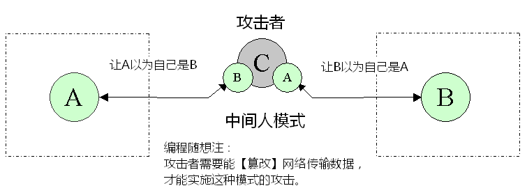

# 扫盲 HTTPS 和 SSL/TLS 协议[2]：可靠密钥交换的原理

[原文](http://program-think.blogspot.com/2014/11/https-ssl-tls-2.html)

## 文章目录

- 方案1——单纯用“对称加密算法”的可行性
- 方案2——单纯用“非对称加密算法”的风险
- 方案2失败的根源——缺乏【可靠的】身份认证
- 身份认证的几种方式
- 如何解决 SSL 的身份认证问题——CA 的引入
- 方案3——基于 CA 证书进行密钥交换
- 关于“客户端证书”
- 结尾

　　在[本系列的前一篇](2015_05_23_002.md)，已经介绍了相关的背景知识以及设计 SSL 需要考虑的需求。当时俺提到：设计 HTTPS 的最大难点（没有之一）是——如何在互联网上进行安全的“密钥交换”。今天就来讲讲密钥交换的原理（暂不谈技术实现）。

## 方案1——单纯用“对称加密算法”的可行性

　　首先简单阐述一下，“单纯用对称加密”为啥是【不可行】滴。
　　如果“单纯用对称加密”，浏览器和网站之间势必先要交换“对称加密的密钥”。
　　如果这个密钥直接用【明文】传输，很容易就会被第三方（有可能是“攻击者”）偷窥到；如果这个密钥用密文传输，那就再次引入了“如何交换加密密钥”的问题——这就变成“先有鸡还是先有蛋”的循环逻辑了。
　　所以，【单纯用】对称加密，是没戏滴。

## 方案2——单纯用“非对称加密算法”的风险

　　说完“对称加密”，再来说说“非对称加密”。
　　在前面的“背景知识”中，已经大致介绍过“非对称加密”的特点——“加密和解密采用不同的密钥”。基于这个特点，可以避开前面提到的“循环逻辑”的困境。大致的步骤如下：

    第1步
    网站服务器先基于“非对称加密算法”，随机生成一个“密钥对”（为叙述方便，称之为“k1 和 k2”）。因为是随机生成的，目前为止，只有网站服务器才知道 k1 和 k2。

    第2步
    网站把 k1 保留在自己手中，把 k2 用【明文】的方式发送给访问者的浏览器。
    因为 k2 是明文发送的，自然有可能被偷窥。不过不要紧。即使偷窥者拿到 k2，也【很难】根据 k2 推算出 k1
    （这一点是由“非对称加密算法”从数学上保证的）。

    第3步
    浏览器拿到 k2 之后，先【随机生成】第三个对称加密的密钥（简称 k）。
    然后用 k2 加密 k，得到 k'（k' 是 k 的加密结果）
    浏览器把 k' 发送给网站服务器。

    由于 k1 和 k2 是成对的，所以只有 k1 才能解密 k2 的加密结果。
    因此这个过程中，即使被第三方偷窥，第三方也【无法】从 k' 解密得到 k

    第4步
    网站服务器拿到 k' 之后，用 k1 进行解密，得到 k
    至此，浏览器和网站服务器就完成了密钥交换，双方都知道 k，而且【貌似】第三方无法拿到 k
    然后，双方就可以用 k 来进行数据双向传输的加密。

　　现在，给大伙儿留一个思考时间——你觉得上述过程是否严密？如果不严密，漏洞在哪里？

　　OK，现在俺来揭晓答案。“方案2”依然是不安全滴——虽然“方案2”可以在一定程度上防止网络数据的【偷窥/嗅探】，但是【无法】防范网络数据的【篡改】。
　　假设有一个攻击者处于“浏览器”和“网站服务器”的通讯线路之间，并且这个攻击者具备“修改双方传输数据”的能力。那么，这个攻击者就可以攻破“方案2”。具体的攻击过程如下：

    第1步
    这一步跟原先一样——服务器先随机生成一个“非对称的密钥对”k1 和 k2（此时只有网站知道 k1 和 k2）

    第2步
    当网站发送 k2 给浏览器的时候，攻击者截获 k2，保留在自己手上。
    然后攻击者自己生成一个【伪造的】密钥对（以下称为 pk1 和 pk2）。
    攻击者把 pk2 发送给浏览器。

    第3步
    浏览器收到 pk2，以为 pk2 就是网站发送的。
    浏览器不知情，依旧随机生成一个对称加密的密钥 k，然后用 pk2 加密 k，得到密文的 k'
    浏览器把 k' 发送给网站。
    （以下是关键）
    发送的过程中，再次被攻击者截获。
    因为 pk1 pk2 都是攻击者自己生成的，所以攻击者自然就可以用 pk1 来解密 k' 得到 k
    然后，攻击者拿到 k 之后，用之前截获的 k2 重新加密，得到 k''，并把 k'' 发送给网站。

    第4步
    网站服务器收到了 k'' 之后，用自己保存的 k1 可以正常解密，所以网站方面不会起疑心。
    至此，攻击者完成了一次漂亮的偷梁换柱，而且让双方都没有起疑心。

　　上述过程，也就是传说中大名鼎鼎的“中间人攻击”。洋文叫做“Man-In-The-Middle attack”。缩写是 MITM。
　　“中间人攻击”有很多种“类型”，刚才演示的是针对“【单纯的】非对称加密”的中间人攻击。至于“中间人攻击”的其它类型，俺在本系列的后续博文中，还会再提到。

　　为了更加形象，补充两张示意图，分别对应“偷窥模式”和“中间人模式”。让你更直观地体会两者的差异。

## 方案2失败的根源——缺乏【可靠的】身份认证

　　为啥“方案2”会失败？
　　除了俺在图中提到的“攻击者具备篡改数据的能力”，还有另一点关键点——“方案2缺乏身份认证机制”。
　　正是因为“缺乏身份认证机制”，所以当攻击者一开始截获 k2 并把自己伪造的 pk2 发送给浏览器时，浏览器无法鉴别：自己收到的密钥是不是真的来自于网站服务器。
　　假如具备某种【可靠的】身份认证机制，即使攻击者能够篡改数据，但是篡改之后的数据很容易被识破。那篡改也就失去了意义。

## 身份认证的几种方式

　　下面，俺来介绍几种常见的“身份认证原理”。

- 基于某些“私密的共享信息”

　　为了解释“私密的共享信息”这个概念，咱们先抛开“信息安全”，谈谈日常生活中的某个场景。
　　假设你有一个久未联系的老朋友。因为时间久远，你已经没有此人的联系方式了。某天，此人突然给你发了一封电子邮件。
　　那么，你如何确保——发邮件的人确实是你的老朋友捏？
　　有一个办法就是：你用邮件向对方询问某个私密的事情（这个事情只有你和你的这个朋友知道，其他人不知道）。如果对方能够回答出来，那么对方【很有可能】确实是你的老朋友。
　　从这个例子可以看出，如果通讯双方具有某些“私密的共享信息”（只有双方知道，第三方不知道），就能以此为基础，进行身份认证，从而建立信任。

- 基于双方都信任的“公证人”

　　“私密的共享信息”，通常需要双方互相比较熟悉，才行得通。如果双方本来就互不相识，如何进行身份认证以建立信任关系捏？
　　这时候还有另一个办法——依靠双方都信任的某个“公证人”来建立信任关系。
　　如今 C2C 模式的电子商务，其实用的就是这种方式——由电商平台充当公证人，让买家与卖家建立某种程度的信任关系。
　　考虑到如今的网购已经相当普及，大伙儿应该对这类模式很熟悉吧。所以俺就不浪费口水了。

## 如何解决 SSL 的身份认证问题——CA 的引入

　　说完身份认证的方式/原理，再回到 SSL/TLS 的话题上。
　　对于 SSL/TLS 的应用场景，由于双方（“浏览器”和“网站服务器”）通常都是互不相识的，显然不可能采用第一种方式（私密的共享信息），而只能采用第二种方式（依赖双方都信任的“公证人”）。
　　那么，谁来充当这个公证人捏？这时候，CA 就华丽地登场啦。
　　所谓的 CA，就是“数字证书认证机构”的缩写，洋文全称叫做“Certificate Authority”。关于 CA 以及 CA 颁发的“CA 证书”，俺已经写过一篇教程：[《数字证书及CA的扫盲介绍》](2015_05_23_004.md)，介绍其基本概念和功能。所以，此处就不再重复唠叨了。
　　如果你看完那篇 CA 的扫盲，你自然就明白——CA 完全有资格和能力，充当这个“公证人”的角色。

## 方案3——基于 CA 证书进行密钥交换

　　其实“方案3”跟“方案2”很像的，主要差别在于——“方案3”增加了“CA 数字证书”这个环节。所谓的数字证书，技术上依赖的还是前面提到的“非对称加密”。为了描述“CA 证书”在 SSL/TLS 中的作用，俺大致说一下原理（仅仅是原理，具体的技术实现要略复杂些）：

    第1步（这是“一次性”的准备工作）
    网站方面首先要花一笔银子，在某个 CA 那里购买一个数字证书。
    该证书通常会对应几个文件：其中一个文件包含公钥，还有一个文件包含私钥。
    此处的“私钥”，相当于“方案2”里面的 k1；而“公钥”类似于“方案2”里面的 k2。
    网站方面必须在 Web 服务器上部署这两个文件。

    所谓的“公钥”，顾名思义就是可以公开的 key；而所谓的“私钥”就是私密的 key。
    其实前面已经说过了，这里再唠叨一下：
    “非对称加密算法”从数学上确保了——即使你知道某个公钥，也很难（不是不可能，是很难）根据此公钥推导出对应的私钥。

    第2步
    当浏览器访问该网站，Web 服务器首先把包含公钥的证书发送给浏览器。

    第3步
    浏览器验证网站发过来的证书。如果发现其中有诈，浏览器会提示“CA 证书安全警告”。
    由于有了这一步，就大大降低了（注意：是“大大降低”，而不是“彻底消除”）前面提到的“中间人攻击”的风险。

    为啥浏览器能发现 CA 证书是否有诈？
    因为正经的 CA 证书，都是来自某个权威的 CA。如果某个 CA 足够权威，那么主流的操作系统（或浏览器）会内置该 CA 的“根证书”。
    （比如 Windows 中就内置了几十个权威 CA 的根证书）
    因此，浏览器就可以利用系统内置的根证书，来判断网站发过来的 CA 证书是不是某个 CA 颁发的。
    （关于“根证书”和“证书信任链”的概念，请参见之前的教程《数字证书及CA的扫盲介绍》）

    第4步
    如果网站发过来的 CA 证书没有问题，那么浏览器就从该 CA 证书中提取出“公钥”。
    然后浏览器随机生成一个“对称加密的密钥”（以下称为 k）。用 CA 证书的公钥加密 k，得到密文 k'
    浏览器把 k' 发送给网站。

    第5步
    网站收到浏览器发过来的 k'，用服务器上的私钥进行解密，得到 k。
    至此，浏览器和网站都拥有 k，“密钥交换”大功告成啦。

## 关于“客户端证书”

　　前面介绍的“方案3”仅仅使用了“服务端证书”——通过服务端证书来确保服务器不是假冒的。
　　除了“服务端证书”，在某些场合中还会涉及到“客户端证书”。所谓的“客户端证书”就是用来证明客户端（浏览器端）访问者的身份。
　　比如在某些金融公司的内网，你的电脑上必须部署“客户端证书”，才能打开重要服务器的页面。
　　由于本文主要介绍的是【公网】上的场景，这种场景下大都【不需要】“客户端证书”。所以，对“客户端证书”这个话题，俺就偷个懒，略过不提。

## 结尾

　　可能有同学会问：那么“方案3”是否就足够严密，无懈可击了捏？
　　俺只能说，“方案3”【从理论上讲】没有明显的漏洞。目前的 SSL/TLS 大致采用的就是这个方案。
　　但是，“理论”一旦落实到“实践”，往往是有差距滴，会引出新的问题。套用某 IT 大牛的名言，就是："In theory, there is no difference between theory and practice. But in practice, there is."
　　所以在本系列的后续博文，俺还会再来介绍“针对 SSL/TLS 的种种攻击方式”以及“对应的防范措施”。
　　下一篇，打算大致说一下“协议的实现”。