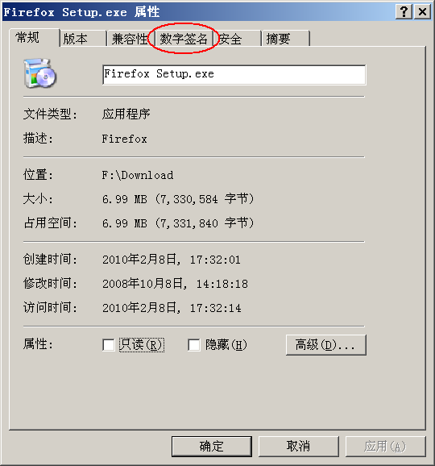
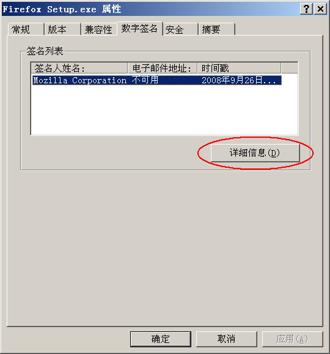
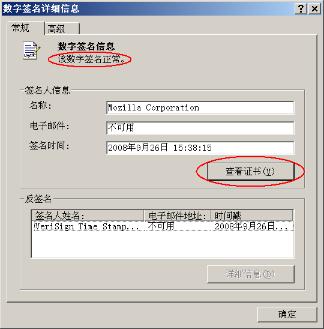
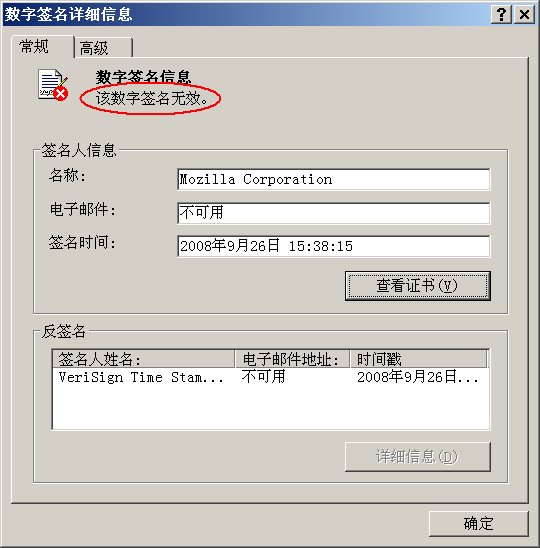

# 扫盲文件完整性校验——关于散列值和数字签名

[原文](http://program-think.blogspot.com/2013/02/file-integrity-check.html)

## 文章目录

- 什么是“完整性校验”？
- 散列算法（哈希算法）扫盲
- 关于散列算法的可靠性
- 散列值校验的步骤
- 散列值校验的工具——FCIV
- 什么是“数字签名”？
- Windows 平台的“数字签名”
- PGP/GPG 的数字签名

　　近期有网友在博客中留言，希望俺介绍散列值校验文件的知识。所以俺干脆写一篇“文件完整性校验”的扫盲教程。由于本文是扫盲性质，尽量不涉及太技术化的内容。

## 什么是“完整性校验”？

　　所谓的“完整性校验”，顾名思义，就是检查文件是否完整。那么，什么情况下会导致文件不完整捏？大概有如下几种情况。

　　1. 感染病毒
　　比方说你的系统中了病毒，病毒感染了某个软件安装包或者某个可执行程序。那么该文件的完整性就被破坏了。

　　2. 植入木马/后门
　　还有一种文件不完整的情况，是被别有用心的人植入木马或后门。比方说某些国内的软件下载站点，它们提供的 Windows 安装光盘镜像已经被安置了后门。

　　3. 传输故障
　　这种情况主要发生在网络下载时。因为网络传输是有可能发生误码的（传输错误），另外还有可能下载到快结束的时候断线（没下载全）。这些情况都会导致你下载的文件不完整。
　　如今的上网环境相比当年的 Modem 拨号，已经有明显改善。所以这种情况应该不多见了。

## 散列算法（哈希算法）扫盲

- 什么是“散列算法/哈希算法”？

　　这里所说的“散列”是一种计算机算法，洋文叫做 Hash，有时候也根据音译称为哈希。
　　散列算法可以把任意尺寸的数据（原始数据）转变为一个【固定尺寸】的“小”数据（叫“散列值”或“摘要”）。

- 摘要长度

　　对于某个具体的散列算法，得到的散列值长度总是固定的。散列值的长度又称“摘要长度”。
　　以下是常见散列算法的摘要长度

CRC32  32比特（4字节）
MD5  128比特（16字节）
SHA1 160比特（20字节）

- 散列算法的特色

　　1. 不可逆性
　　从刚才的描述看，散列似乎有点像压缩。其实捏，散列算法跟压缩算法是完全不同滴。压缩算法是可逆的（可以把压缩后的数据再还原），而【散列算法是不可逆的】。
　　还有一些人把散列算法称为“加密算法”，这也是不对的。因为加密算法是可逆的（“加密”的逆操作就是“解密”），而散列算法是【不可逆】的。

　　2. 确定性
　　通过某种散列算法，分别对两个原始数据计算散列值。如果算出来的散列值不同，那么可以 100% 肯定这两段数据是不同的——这就是“确定性”。
　　但反过来，如果这两段数据的散列值相同，则只能说，这两段数据【非常可能】相同。所谓的“非常可能”，就是说，还达不到百分百。具体原因，请看下一节“散列函数的可靠性”。

## 关于散列算法的可靠性

- 什么是“散列碰撞”？

　　刚才说了，存在非常小的可能性，导致两段不同的原始数据，计算出相同的散列值。这种情况称之为“散列碰撞”或“散列冲突”。

- 碰撞的类型

　　散列碰撞的类型，大体上有两种：

　　1. 随机碰撞
　　随机碰撞就像买彩票中大奖，完全是出于小概率的偶然因素——你碰巧遇见两个不同的数据（文件），具有相同的散列值。
　　理论上讲，任何散列算法都存在随机碰撞的可能性，只是可能性有大有小。

　　2. 人为碰撞
　　人为碰撞就是说，有人（通常是恶意的攻击者）故意制造散列碰撞，以此来骗过“基于散列值的完整性校验”。

- 如何避免碰撞

　　1. 对于随机碰撞
　　要避免随机碰撞，很简单，只需要选择摘要长度足够长的散列算法。
　　拿前面举的3个例子。
　　CRC32 的摘要长度是 32bit，也就说，最多可以表示“2的32次方”这么多种可能性（也就是几十亿，数量级相当于地球总人口）。表面上看貌似很大，其实还不够大。比如当前互联网上的页面总数就已经大大超过“几十亿”。如果对每个页面计算 CRC32 散列，会碰到很多重复（碰撞）。
　　而 MD5 的摘要长度是128bit，也就是 2的128次方。这个数字足够大了。通俗地说，从宇宙诞生到宇宙毁灭，你都未必有机会碰见 MD5 的【随机】碰撞。而 SHA1 的摘要长度是160bit，那就更不用说了。

　　2. 对于人为碰撞
　　想避免人为碰撞，要同时兼顾两个因素——散列算法的摘要长度、散列算法的优秀程度。“摘要长度”刚才已经解释了。光说一下“算法的优秀程度”。
　　如果某个散列算法有缺陷（不够优秀），那么攻击者就可以比较容易地构造出两个【不同的】原始数据，但却拥有【相同的】散列值。如此一来，就可以骗过基于散列算法的完整性检查。
　　典型的例子就是 MD5，MD5算法在过去10多年里曾经非常流行，但是前几年被发现存在严重缺陷。所以，MD5 虽然随机碰撞的概率非常非常低，但人为碰撞的概率可不低。如果你比较注重安全性，尽量不要依赖 MD5 进行完整性校验。

## 散列值校验的步骤

　　如今，大伙儿的安全意识越来越高了。相应的，很多知名的软件，除了在官网上提供下载，还会相应提供下载软件的散列值。当你下载好某个软件之后，先在自己电脑里计算一下散列值，然后跟官方网站提供的散列值对比一下。如果散列值一样，通常就说明没问题。
　　再啰嗦一下：
　　尽量不要用 MD5（早在好多年前，就已经被证明是【不】可靠的）。另外，随着硬件计算能力的提升，即使是 SHA1 也开始变得不安全了。今后 SHA1 会逐步被 SHA256 或 SHA512 替代。

　　下面，介绍几个常用软件的散列值页面，便于大伙儿查询

　　微软的产品
　　到“[这个页面](http://msdn.microsoft.com/zh-cn/subscriptions/downloads/default.aspx)”可以查微软发布的所有产品的散列值。微软的产品很多，先根据类型或名称筛选，找到某产品后，点“详细信息”，就可以看到 SHA1 散列值。

　　Firefox 浏览器
　　打开如下链接，可以看到 Firefox 某个版本的 SHA1 列表（把链接中的 XXXX 替换为版本号，比如18.0.2）。这个列表很长，包括各种语言，各个平台。为了方便起见，你可以先算好 SHA1 散列值，然后到里面搜索该散列值
`https://ftp.mozilla.org/pub/mozilla.org/firefox/releases/XXXX/SHA1SUMS`

## 散列值校验的工具——FCIV

　　前面说完了校验的流程，最后再说一下校验的工具。
　　考虑到大部分读者是 Windows 用户，俺介绍一下微软官方的 FCIV（全称是 File Checksum Integrity Verifier）。这是一个小巧、绿色、免费的命令行工具，下载页面在“[这里](http://support.microsoft.com/kb/841290/)”。
　　因为是命令行工具，你需要先运行 CMD，出现 Windows 的命令行界面（黑窗口）之后，在其中使用该工具。下面是 FCIV 功能简介。

- 计算单个文件

　　比如你有一个微软的系统安装光盘镜像，位于 C:\download\Windows.iso 那么，用如下命令可以计算该文件的 SHA1 散列值

    fciv -sha1 C:\download\Windows.iso

- 批量计算某个目录

　　FCIV 支持批量计算某个目录下的文件散列值。比方说，可以用如下命令可以计算 C:\download 目录下的每一个文件的 SHA1

    fciv -sha1 C:\download\

- 批量计算并存储，供前后对比

　　比如 C:\download 目录下有很多文件。俺想知道过一段时间之后，这些文件是否被改过。那么，可以先用如下命令，把该目录中所有文件的 SHA1 散列都存储到某个 xml 文件中（本例中，保存到 C:\hash.xml，你也可以保存到其它文件名）

    fciv -sha1 C:\download\ -xml C:\hash.xml

　　过了一段时间后，你可以用如下命令，就可以看出哪些文件被修改过。

    fciv -sha1 C:\download\ -xml C:\hash.xml -v

## 什么是“数字签名”？

　　所谓的“数字签名”，通俗来说，就是采用某种技术手段来证明某个信息确实是由某个机构（或某个人）发布的。因为其用途有点类似于传统的手写签字，所以称之为“数字签名”。
　　数字签名的技术实现需要依赖于“非对称加密技术”和“数字证书体系”。关于“非对称加密技术”，考虑到篇幅，今天就不展开了；关于“数字证书”，3年前写过一篇扫盲（在“这里”），有兴趣的同学可以瞧一瞧，这里就不再啰嗦了。

## Windows 平台的“数字签名”

　　数字签名有很多种，大伙儿比较常见的是 Windows 平台下的数字签名。如今大型 IT 公司（比如：微软、Google、苹果、等）或者是知名开源组织发布的 Windows 软件，安装文件通常都内置数字签名。所以俺着重介绍 Windows 平台的数字签名该如何校验。

- 利用资源管理器验证单个文件

　　大概从 Windows 2000开始，Windows 就支持在某个文件尾部附加数字签名，并且 Windows 的资源管理器内置了对数字签名的校验功能。
　　下面俺通过几个截图，简单介绍一下：如何在资源管理器中验证数字签名。

　　比如，俺手头有一个 Firefox 的安装文件（带有数字签名）。当俺查看该文件的属性，会看到如下的界面。眼神好的同学，会注意到到上面有个“数字签名”的标签页。如果没有出现这个标签页，就说明该文件没有附带数字签名。

　　选择该标签页，出现如下界面。
　　顺便说一下，某些数字签名中没有包含“邮件地址”，那么这一项会显示“不可用”；同样的，某些数字签名没有包含“时间戳”，也会显示“不可用”。不要紧张，这里显示的“不可用”跟数字签名的有效性没关系。

　　一般来说，签名列表中，有且仅有一个签名。选中它，点“详细信息”按钮。跳出如下界面：
　　通常这个界面会显示一行字：该数字签名正常（图中红圈标出）。如果有这行字，就说明该文件从出厂到你手里，中途没有被篡改过（是原装滴、是纯洁滴）。

　　如果该文件被篡改过了（比如，感染了病毒、被注入木马），那么对话框会出现一个警告提示：该数字签名无效（图中红圈标出），界面如下。一旦出现数字签名无效，那这个文件就不要再使用了。

- 利用命令行工具批量验证

　　用上面的图形化界面进行验证，比较傻瓜化。但有一个缺点——如果你要验证的文件比较多，一个一个去点对话框，手会抽筋滴。所以，俺再介绍一下命令行的工具，适合进行批量验证。
　　这个命令行工具就是微软官网提供的 SigCheck，由大名鼎鼎的 SysInternals 出品（SysInternals 已经被微软收购）。跟前面提到的 FCIV 类似，它也是一个小巧、绿色、免费的命令行工具，下载页面在“[这里](http://technet.microsoft.com/en-us/sysinternals/bb897441.aspx)”。

　　使用如下命令，可以批量检查某个目录下（包括多层嵌套子目录）的所有可执行程序，并且把“无签名”或者“签名无效”的文件列出来。

    sigcheck -u -e -s 某个目录的路径名

先提醒一下，检查数字签名的有效性本身就比较慢，如果目录下的文件很多，你要有足够的耐心等它运行完毕。

　　稍微补充一下，这个 SigCheck 命令还顺便提供了散列值（命令格式如下），该功能可替代 FCIV 的头两个功能，可惜无法替代 FCIV 的第三个功能。

    sigcheck -h 某个目录或文件的路径名

## PGP/GPG 的数字签名

　　刚才聊了 Windows 平台滴。但是，切莫以为只有 Windows 平台才提供数字签名——其它的数字签名工具还有好几种。名气比较大的数字签名工具当属 PGP/GPG。这两个缩写就像绕口令，很容易搞混。PGP 是商业软件，而 GPG 是 GnuPG 的缩写，是 GNU 的开源项目。后者是前者的开源替代品，两者的功能基本兼容。
　　这俩玩意儿的功能很强悍，校验数字签名对它俩只是小菜一碟。考虑到大伙儿平时较少碰到 GPG 的签名，俺今天就偷懒一下，暂不介绍。以后如果有空，再专门写一篇帖子介绍 PGP/GPG 的各种功能和使用场景。